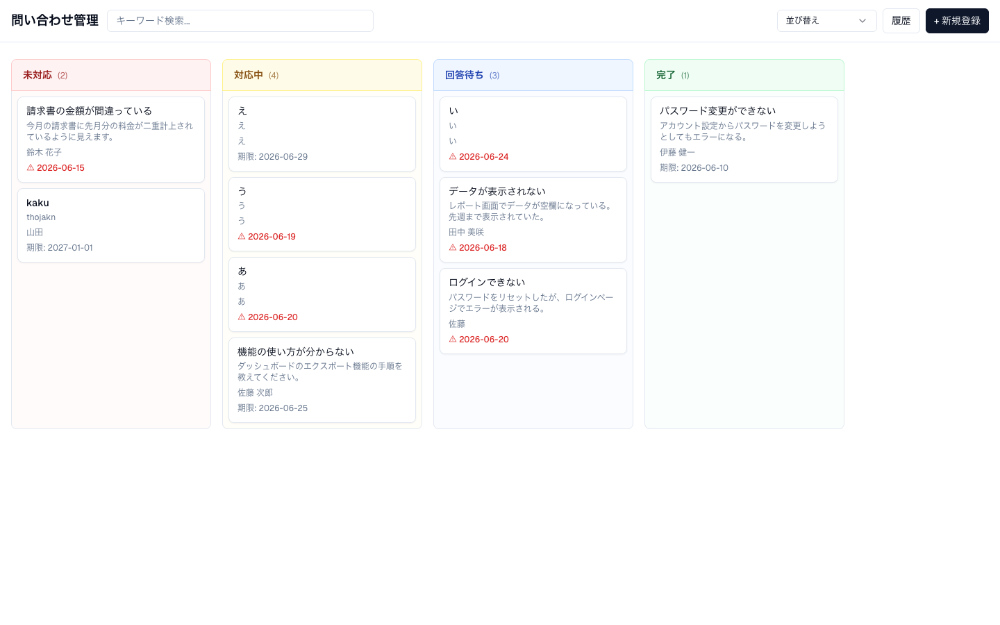
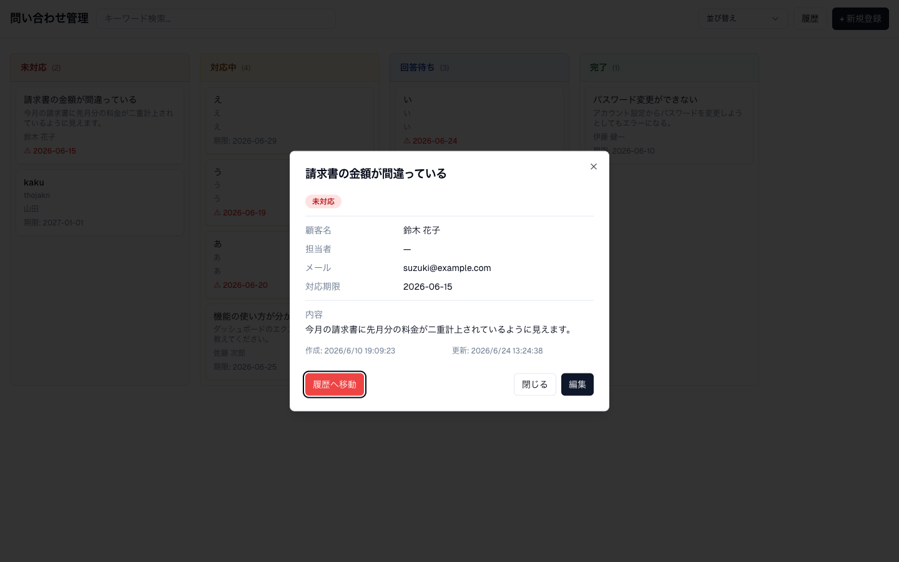
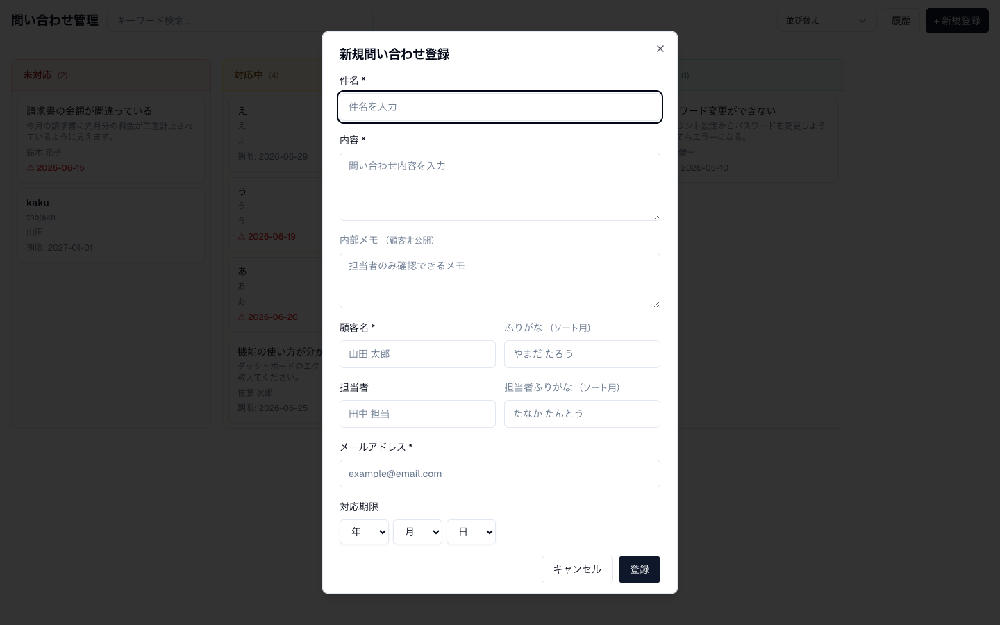

# Inquiry Management

顧客からの問い合わせを一元管理するWebアプリケーションです。
カンバンボード形式でステータス管理・ドラッグ&ドロップによる直感的な操作を提供します。

## スクリーンショット

### カンバンボード



### 詳細ダイアログ



### 新規登録フォーム



## 技術スタック

| 領域 | 技術 |
|------|------|
| フロントエンド | Next.js 15 / TypeScript / TailwindCSS / Radix UI |
| バックエンド | Kotlin / Spring Boot 3.2 |
| データベース | MySQL 8.0 |
| インフラ | AWS EC2 + RDS / Nginx / Terraform |

## 機能

- 問い合わせのCRUD操作（顧客名・担当者・内部メモ・対応期限）
- ステータス管理（未対応 / 対応中 / 回答待ち / 完了）
- ドラッグ&ドロップによるステータス変更・カラム内並び替え
- 顧客名・担当者のふりがな順ソート（読み順）
- 期限・作成日時によるソート
- キーワード検索
- 論理削除と削除済み履歴管理（管理者パスワードで完全削除）

## プロジェクト構成

```
inquiry-management/
├── frontend/      # Next.js アプリ
├── backend/       # Kotlin + Spring Boot
├── terraform/     # インフラ構成
├── docs/          # 設計ドキュメント
└── README.md
```

## ドキュメント

- [要件定義書](docs/requirements.md)
- [機能要件定義書](docs/functional-requirements.md)
- [技術スタック](docs/tech-stack.md)
- [システムアーキテクチャ](docs/architecture.md)
- [ER図](docs/er-diagram.md)

## セットアップ

### 前提条件

| ツール | バージョン |
|--------|-----------|
| Docker Desktop | 最新版 |
| Java (JDK) | 17 以上 |
| Node.js | 18 以上 |

### ローカル開発環境

#### 1. リポジトリをクローン

```bash
git clone <repository-url>
cd inquiry-management
```

#### 2. MySQL を Docker で起動

```bash
docker compose up -d db
```

> `docker ps` で `inquiry-db` が `healthy` になるまで待ちます（通常 10〜20 秒）。

#### 3. データベースの初期化

Flyway はローカルでは無効のため、マイグレーション SQL を手動で適用します。

```bash
# MySQL に接続
docker exec -it inquiry-db mysql -u root -ppassword inquiry_db

# MySQL プロンプトに入ったら、以下を順番に実行
mysql> source /dev/stdin
# ここでは各ファイルの内容をコピー&ペーストするか、以下のワンライナーを使用:
```

または、ホスト側から一括適用する場合:

```bash
for f in backend/src/main/resources/db/migration/V{1,2,3,4}__*.sql; do
  docker exec -i inquiry-db mysql -u root -ppassword inquiry_db < "$f"
done
```

#### 4. バックエンド起動

```bash
cd backend
./gradlew bootRun
```

`Started InquiryManagementApplication` が表示されたら起動完了です。
バックエンドは `http://localhost:8080` で待ち受けます。

#### 5. フロントエンド起動

別ターミナルで:

```bash
cd frontend
npm install
npm run dev
```

`http://localhost:3000` をブラウザで開くとアプリが表示されます。

### 環境変数

#### バックエンド（`backend/src/main/resources/application.yml` のデフォルト値）

| 変数名 | デフォルト | 説明 |
|--------|-----------|------|
| `DB_HOST` | `localhost` | MySQL ホスト |
| `DB_PORT` | `3306` | MySQL ポート |
| `DB_NAME` | `inquiry_db` | データベース名 |
| `DB_USER` | `root` | DB ユーザー |
| `DB_PASSWORD` | `password` | DB パスワード |
| `ADMIN_PASSWORD` | `admin1234` | 完全削除用管理者パスワード |
| `CORS_ALLOWED_ORIGINS` | `http://localhost:3000` | CORS 許可オリジン |

#### フロントエンド（`.env.local` に記述）

| 変数名 | デフォルト | 説明 |
|--------|-----------|------|
| `NEXT_PUBLIC_API_URL` | `http://localhost:8080` | バックエンド API の URL |

## ライセンス

[MIT License](LICENSE)
