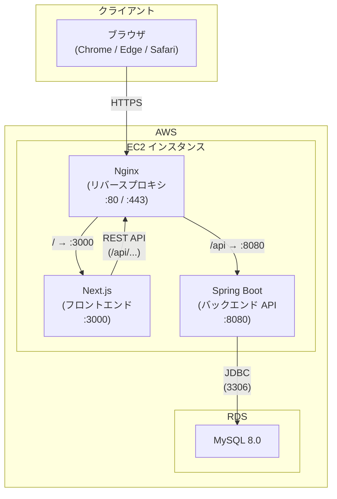
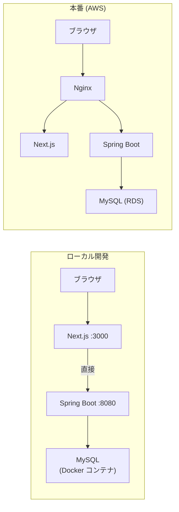
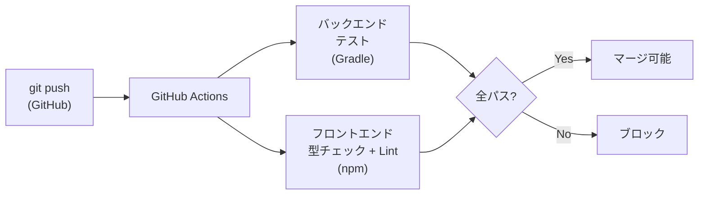

# システムアーキテクチャ

## 全体構成図

## コンポーネント説明

| コンポーネント | 役割 | 技術 |
|-------------|------|------|
| Nginx | リバースプロキシ。`/api/*` をバックエンドへ、それ以外をフロントエンドへルーティング | Nginx 1.24.x |
| Next.js | カンバンボードUI。SSR + クライアントサイドフェッチ (TanStack Query) | Next.js 15 / TypeScript |
| Spring Boot | REST API サーバー。ビジネスロジック・バリデーション・DB アクセスを担当 | Kotlin / Spring Boot 4.x |
| MySQL | 問い合わせデータの永続化。Flyway でスキーマ管理 | MySQL 8.0 (AWS RDS) |

## ローカル開発環境との差異

| 項目 | ローカル | 本番 |
|------|---------|------|
| DB | Docker コンテナ (MySQL) | AWS RDS |
| プロキシ | なし（直接アクセス） | Nginx |
| Flyway | 無効（手動 SQL 適用） | 有効（自動マイグレーション） |
| 環境変数 | `.env` / デフォルト値 | EC2 環境変数 |

## CI/CD フロー

