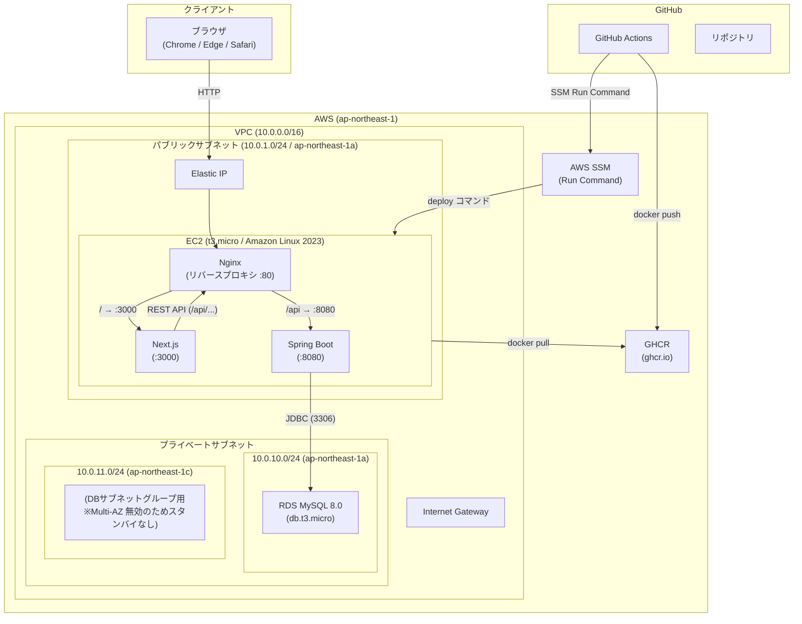
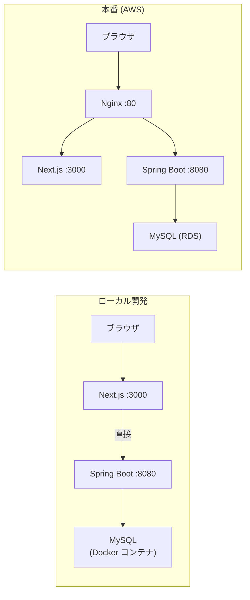
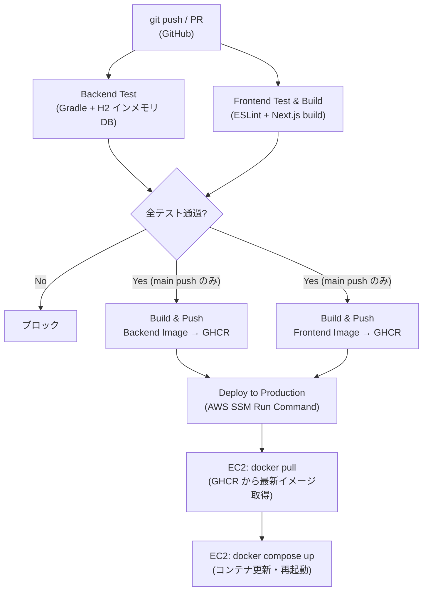

# システムアーキテクチャ

## 全体構成図



## ネットワーク設計

### VPC 構成

| リソース | 値 | 備考 |
|---------|-----|------|
| VPC CIDR | `10.0.0.0/16` | DNS ホスト名・DNS 解決を有効化 |
| パブリックサブネット | `10.0.1.0/24` | EC2 配置・インターネット接続可 |
| プライベートサブネット 1 | `10.0.10.0/24` | RDS 配置・ap-northeast-1a |
| プライベートサブネット 2 | `10.0.11.0/24` | RDS サブネットグループ用・ap-northeast-1c |
| Internet Gateway | - | パブリックサブネットからのインターネット通信 |

### セキュリティグループ

**EC2 セキュリティグループ**

| ポート | プロトコル | 方向 | 許可元 |
|--------|-----------|------|-------|
| 22 (SSH) | TCP | インバウンド | 運用者 IP のみ |
| 80 (HTTP) | TCP | インバウンド | 運用者 IP のみ |
| 3000 (Next.js) | TCP | インバウンド | 運用者 IP のみ |
| 8080 (Spring Boot) | TCP | インバウンド | 運用者 IP のみ |
| 全ポート | 全プロトコル | アウトバウンド | 0.0.0.0/0 |

> CI/CD デプロイは AWS SSM Run Command 経由のため SSH (22) は不要。キーペアによる SSH はデバッグ用途のみ。

**RDS セキュリティグループ**

| ポート | プロトコル | 方向 | 許可元 |
|--------|-----------|------|-------|
| 3306 (MySQL) | TCP | インバウンド | EC2 セキュリティグループのみ |

## コンポーネント説明

| コンポーネント | 役割 | 技術 |
|-------------|------|------|
| Nginx | リバースプロキシ。`/api/*` をバックエンドへ、それ以外をフロントエンドへルーティング | Nginx |
| Next.js | カンバンボードUI。SSR + クライアントサイドフェッチ (TanStack Query) | Next.js 15 / TypeScript |
| Spring Boot | REST API サーバー。ビジネスロジック・バリデーション・DB アクセスを担当 | Kotlin / Spring Boot 3.2 |
| MySQL | 問い合わせデータの永続化。Flyway でスキーマ管理 | MySQL 8.0 (AWS RDS) |

## EC2 構成

| 項目 | 設定値 |
|------|-------|
| インスタンスタイプ | t3.micro |
| OS | Amazon Linux 2023 (最新 AMI を自動取得) |
| ストレージ | 20GB gp2 (暗号化済み) |
| IPアドレス | Elastic IP（固定） |
| ランタイム | Docker + Docker Compose |
| IAM ロール | SSM マネージドインスタンス（AmazonSSMManagedInstanceCore） |

## RDS 構成

| 項目 | 設定値 |
|------|-------|
| インスタンスクラス | db.t3.micro |
| エンジン | MySQL 8.0 |
| ストレージ | 20GB gp2（暗号化済み、最大 100GB 自動スケール） |
| 文字コード | utf8mb4 / utf8mb4_unicode_ci |
| タイムゾーン | Asia/Tokyo |
| マルチ AZ | 無効 |
| パブリックアクセス | 無効（EC2 からのみ接続可） |

## IAM 設計

### EC2 インスタンスロール

EC2 が AWS SSM エージェント経由でコマンドを受け付けるために `AmazonSSMManagedInstanceCore` ポリシーをアタッチ。

### GitHub Actions IAM ユーザー

CI/CD パイプラインが EC2 へデプロイコマンドを送信するために専用 IAM ユーザーを作成し、最小権限（SSM Run Command 送信のみ）を付与。

| 権限 | スコープ |
|------|---------|
| `ssm:SendCommand` | 対象 EC2 インスタンス + `AWS-RunShellScript` ドキュメントのみ |
| `ssm:GetCommandInvocation` / `ssm:ListCommandInvocations` | 全リソース（AWS の制約上 `*` 必須） |

## ローカル開発環境との差異



| 項目 | ローカル | 本番 |
|------|---------|------|
| DB | Docker コンテナ (MySQL) | AWS RDS (db.t3.micro) |
| プロキシ | なし（直接アクセス） | Nginx |
| Flyway | 無効（手動 SQL 適用） | 有効（自動マイグレーション） |
| 環境変数 | `.env.local` / デフォルト値 | EC2 環境変数 |
| コンテナ | Docker Compose (DB のみ) | Docker Compose (全サービス) |

## CI/CD フロー



### デプロイ方式

SSH ではなく **AWS SSM Run Command** を使用。EC2 にパブリックな SSH ポートを開放せずに安全にデプロイコマンドを実行できる。

| ステップ | 内容 |
|---------|------|
| 1. テスト | バックエンド (Gradle)・フロントエンド (ESLint + build) を並行実行 |
| 2. ビルド | Docker イメージをビルドして GHCR (ghcr.io) へ push |
| 3. デプロイ | SSM Run Command 経由で EC2 に docker pull + docker compose up を実行 |
| 4. 確認 | SSM コマンドの実行ステータスを最大 10 分ポーリング |

### GitHub Secrets

| Secret 名 | 用途 |
|-----------|------|
| `AWS_ACCESS_KEY_ID` | GitHub Actions IAM ユーザーのアクセスキー |
| `AWS_SECRET_ACCESS_KEY` | GitHub Actions IAM ユーザーのシークレットキー |
| `EC2_INSTANCE_ID` | デプロイ先 EC2 インスタンス ID |
| `NEXT_PUBLIC_API_URL` | フロントエンドビルド時の API エンドポイント URL |

## プロジェクト構成

```
inquiry-management/
├── frontend/                   # Next.js アプリ
│   ├── src/
│   │   ├── app/                # App Router ページ
│   │   ├── components/         # UI コンポーネント
│   │   ├── hooks/              # TanStack Query フック
│   │   ├── lib/                # Axios クライアント
│   │   └── types/              # TypeScript 型定義
│   ├── Dockerfile
│   └── package.json
├── backend/                    # Kotlin + Spring Boot アプリ
│   ├── src/main/kotlin/        # アプリケーションコード
│   ├── src/main/resources/
│   │   ├── application.yml     # 設定ファイル
│   │   └── db/migration/       # Flyway マイグレーション SQL
│   ├── Dockerfile
│   └── build.gradle.kts
├── terraform/                  # インフラ as Code (AWS リソース定義)
│   ├── provider.tf             # AWS プロバイダー・S3 バックエンド設定
│   ├── variables.tf            # 変数定義
│   ├── ec2.tf                  # VPC・サブネット・EC2・Elastic IP
│   ├── rds.tf                  # RDS・プライベートサブネット
│   ├── iam.tf                  # IAM ロール・GitHub Actions ユーザー
│   ├── outputs.tf              # 出力値（IP・エンドポイント等）
│   └── terraform.tfvars.example # 変数サンプル（tfvars は Git 管理外）
├── docs/                       # 設計ドキュメント
├── docker-compose.yml          # ローカル開発用 DB / 本番デプロイ用
└── .github/workflows/ci-cd.yml # CI/CD パイプライン定義
```
