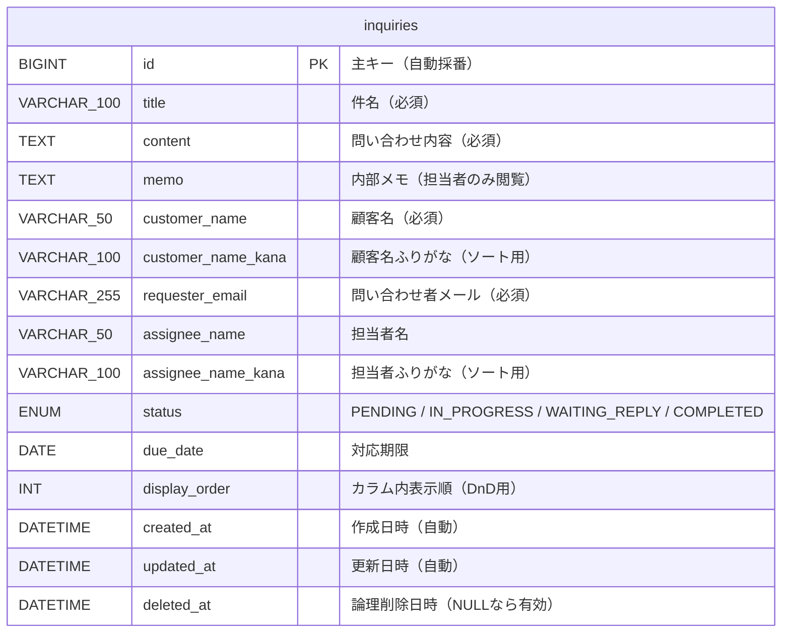
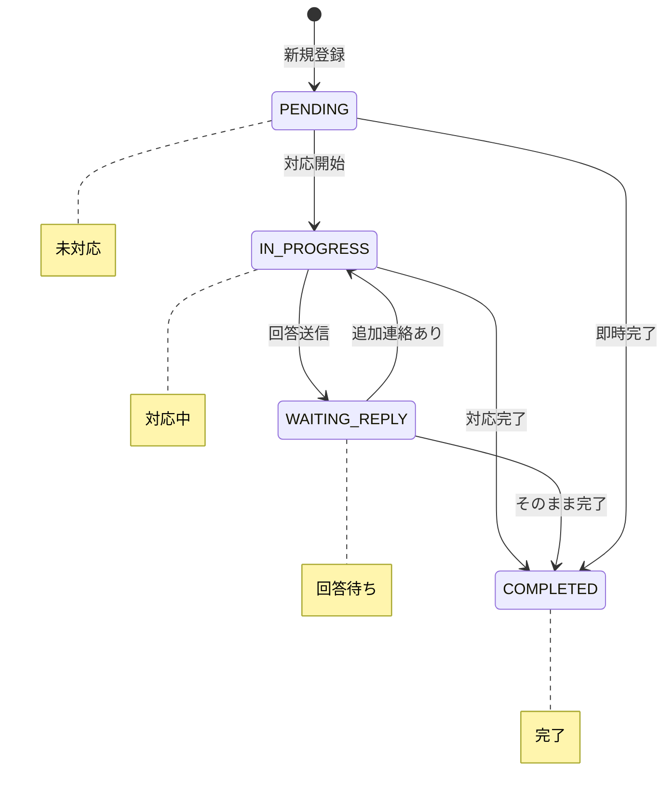

# ER図

## テーブル構成

本システムは単一テーブル `inquiries` で構成されています。

## カラム詳細

| カラム名 | 型 | NULL | デフォルト | 説明 |
|---------|-----|------|-----------|------|
| id | BIGINT | NO | AUTO_INCREMENT | 主キー |
| title | VARCHAR(100) | NO | — | 件名 |
| content | TEXT | NO | — | 問い合わせ内容 |
| memo | TEXT | YES | NULL | 内部メモ（顧客非公開） |
| customer_name | VARCHAR(50) | NO | — | 顧客名 |
| customer_name_kana | VARCHAR(100) | YES | NULL | 顧客名ふりがな（ソート基準） |
| requester_email | VARCHAR(255) | NO | — | 問い合わせ者メールアドレス |
| assignee_name | VARCHAR(50) | NO | `''` | 担当者名 |
| assignee_name_kana | VARCHAR(100) | YES | NULL | 担当者ふりがな（ソート基準） |
| status | ENUM | NO | `PENDING` | 対応ステータス |
| due_date | DATE | YES | NULL | 対応期限 |
| display_order | INT | NO | 0 | カラム内表示順（DnD並び替え用） |
| created_at | DATETIME | NO | CURRENT_TIMESTAMP | 作成日時 |
| updated_at | DATETIME | NO | CURRENT_TIMESTAMP ON UPDATE | 最終更新日時 |
| deleted_at | DATETIME | YES | NULL | 論理削除日時（NULL = 有効） |

## インデックス

| インデックス名 | カラム | 用途 |
|-------------|-------|------|
| PRIMARY | id | 主キー |
| idx_inquiries_status | status | ステータス絞り込み |
| idx_inquiries_status_order | (status, display_order) | カンバン表示・DnD並び替え |
| idx_inquiries_due_date | due_date | 期限ソート |
| idx_inquiries_deleted_at | deleted_at | 論理削除フィルタ |

## ステータス遷移

## マイグレーション履歴

| バージョン | ファイル | 内容 |
|-----------|---------|------|
| V1 | `V1__create_inquiries_table.sql` | テーブル初期作成 |
| V2 | `V2__insert_sample_data.sql` | サンプルデータ投入 |
| V3 | `V3__update_schema_v2.sql` | ステータス追加・カラムリネーム・担当者・メモ・論理削除追加 |
| V4 | `V4__add_kana_columns.sql` | ふりがなカラム追加 |
